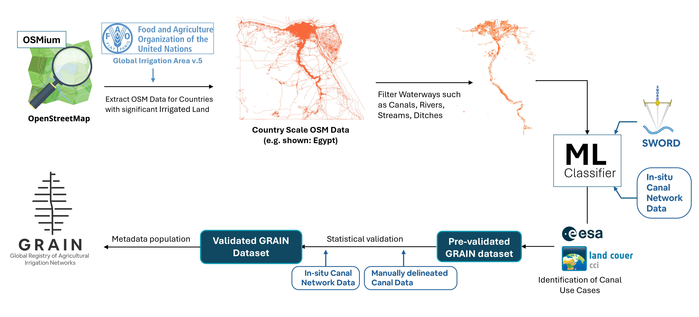

## Global Registry of Agricultural Irrigation Networks
GRAIN is an OpenStreetMap (OSM) based dataset of the world's irrigation canals. OSM country-scale data is retrieved from [Geofrabrik.de](https://www.geofabrik.de/), processed using [OSMium CLI Toolkit](https://osmcode.org/osmium-tool/), and [QGI](https://qgis.org/) to filter for waterways and to convert the OSM PBF file to the lightweight cloud optimised GeoParquet format. 

A Random Forest classifier is used to differentiate between man-made canals and natural rivers to correct tagging issues prevalent in OSM data. Canal use type is determined using [ESA CCI Land Cover](https://www.esa-landcover-cci.org/) dataset. Validation is done on in-stu canal network data obtained from national and regional scale government datasets, and manually delineated canal vector data. 

Dataset available for download at [Zenodo - GRAIN v.1.0](https://doi.org/10.5281/zenodo.16748791)  
GRAIN is made available as country level files in GeoParquet and ESRI shapefile formats, projected to EPSG:4326, based on the WGS-84 datum. Users are recommended to download the GeoParquet files due to the significant smaller file size.

The methodology and validation is described in : [Suresh, S., Hossain, F., Mishra, V., Hossain, N., 2025. GRAIN - Global Registry of Agricultural Canal Networks, Earth System Science Data](https://www.earth-system-science-data.net/) <b style="color:orange;">*Submitted for review</b>

GRAIN workflow:  

